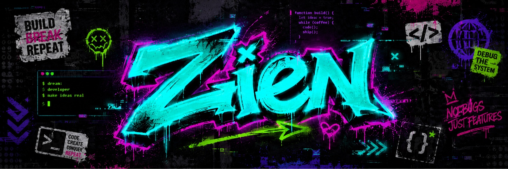

  

---

### 👀 About Me
I first got into programming around 2015, and I’m still mostly driven by the same thing: taking an idea and figuring out how to make it real.

These days I work on EV charging interoperability, distributed backend systems, async workflows, and production reliability. Before that, I worked on payment gateway systems and PCI DSS-scoped payment infrastructure.

Outside of work, I’m exploring AI agents, MCP, quant systems, and small tools that help me learn by building.

### 🧰 Tech Stack
**Languages**

**Messaging &amp; Infrastructure**

**Databases &amp; Caching**

### 📌 Featured Projects
- 📈 **[universe-selector](https://github.com/zients/universe-selector)** — run-centric quantitative universe selector for repeatable market scans
- 🤖 **[line-mcp-server](https://github.com/zients/line-mcp-server)** — MCP server for the LINE Messaging API, built for AI agent workflows
- 🧠 **[awesome-ai-agent-skills](https://github.com/zients/awesome-ai-agent-skills)** — curated Agent Skills list for Claude Code, Codex, Gemini CLI, and other coding agents
- 🔥 **[github-readme-streak-stats](https://github.com/zients/github-readme-streak-stats)** — self-hosted GitHub contribution streak SVG/JSON generator for profile READMEs
